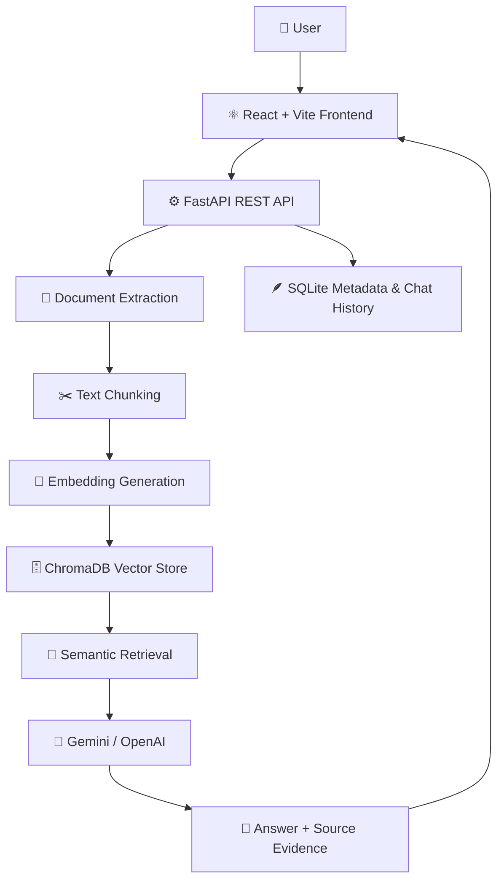

# 🧠 NexaMind AI — Intelligent Document Research Platform

<p align="center">
  <strong>Transform your documents into an intelligent, searchable knowledge base.</strong>
</p>

<p align="center">
  An AI-powered document research assistant built with React, FastAPI, ChromaDB, and Retrieval-Augmented Generation (RAG).
</p>

<p align="center">
  <a href="https://nexamind-ai-beige.vercel.app">🌐 Live Demo</a> •
  <a href="https://nexamind-ai-api.onrender.com/docs">📚 API Documentation</a> •
  <a href="https://nexamind-ai-api.onrender.com/health">💚 API Health</a>
</p>

---

## ✨ Overview

**NexaMind AI** is a full-stack intelligent document research platform that helps users extract knowledge from their documents and ask questions in natural language.

Upload PDF, TXT, or Markdown files, retrieve relevant information through semantic search, and generate context-aware answers using a large language model. Each answer can include supporting source excerpts to help users verify the information.

Instead of manually searching through lengthy documents, NexaMind AI turns your files into an interactive knowledge assistant.

## 🚀 Live Application

| Component | Link | Technology |
|---|---|---|
| 🌐 Frontend | [Open NexaMind AI](https://nexamind-ai-beige.vercel.app) | React + Vite |
| ⚙️ Backend API | [Open API](https://nexamind-ai-api.onrender.com) | FastAPI |
| 📖 API Explorer | [Interactive API Docs](https://nexamind-ai-api.onrender.com/docs) | OpenAPI / Swagger |
| 💚 Health Check | [Check API Health](https://nexamind-ai-api.onrender.com/health) | FastAPI |

> **Note:** The backend is hosted on Render's free tier, so the first request after inactivity may take longer while the service starts.

## 🎯 Key Features

### 📄 Document Intelligence
- Upload PDF, TXT, and Markdown documents.
- Support files up to 15 MB per file.
- Extract text and divide content into manageable chunks.
- Generate embeddings for semantic search.
- Index document content in ChromaDB.

### 🤖 AI-Powered Question Answering
- Ask questions using natural language.
- Retrieve relevant passages from indexed documents.
- Generate evidence-grounded answers using Gemini or OpenAI, depending on the configured provider.
- Return relevant source excerpts alongside answers.
- Support evidence-based responses instead of relying only on general model knowledge.

### 🔎 Retrieval & Source Transparency
- Perform similarity-based retrieval using vector embeddings.
- Display retrieved source passages and document names.
- Inspect the evidence used to answer questions.
- Improve answer verification through source-level context.

### 💬 Research Workspace
- Responsive, dark-themed React interface.
- Interactive document library.
- Question-and-answer workflow.
- Recent conversation history.
- Document deletion and library management.
- Loading and error states for API requests.

### 🛠️ Backend & Persistence
- RESTful API built with FastAPI.
- SQLite database for document metadata and conversation history.
- ChromaDB for vector storage and semantic retrieval.
- Configurable CORS for frontend/backend communication.
- Health endpoint for service monitoring.
- Bounded error handling for supported provider and retrieval failure scenarios.

## 🏗️ System Architecture



### 🔄 How It Works

1. **Upload:** The user uploads a supported document through the frontend.
2. **Extract:** The backend extracts text from the document.
3. **Chunk:** The extracted text is split into smaller passages for retrieval.
4. **Embed:** Text chunks are converted into vector embeddings.
5. **Index:** ChromaDB stores the vectors and associated document content.
6. **Retrieve:** A user question is matched against the indexed passages using semantic similarity.
7. **Generate:** The configured language model receives the question and retrieved context.
8. **Respond:** The API returns the answer and relevant source evidence to the frontend.

## 🧰 Technology Stack

| Layer | Technologies |
|---|---|
| 🎨 Frontend | React, Vite, JavaScript, CSS |
| ⚙️ Backend | Python, FastAPI, Uvicorn |
| 🧠 AI & LLM | Gemini API / OpenAI API |
| 🔍 Retrieval | Embeddings, semantic search, RAG |
| 🗄️ Vector Database | ChromaDB |
| 💾 Metadata Storage | SQLite |
| 📑 Document Processing | PDF extraction, TXT and Markdown parsing |
| 🔐 Configuration | Environment variables, CORS |
| ☁️ Deployment | Vercel, Render |
| 🔗 Source Control | Git, GitHub |

## 📂 Project Structure

```text
nexamind-ai/
│
├── backend/
│   ├── main.py              # FastAPI application and API routes
│   ├── requirements.txt     # Python dependencies
│   ├── .env.example         # Backend environment template
│   ├── .gitignore           # Backend-specific exclusions
│   └── data/                # Local database and vector storage
│
├── frontend/
│   ├── src/
│   │   ├── main.jsx         # React application
│   │   └── styles.css       # Application styling
│   ├── index.html           # Frontend HTML entry point
│   ├── package.json         # Node dependencies and scripts
│   ├── package-lock.json    # Dependency lock file
│   └── .env.example         # Frontend environment template
│
├── .gitignore               # Root Git exclusions
├── render.yaml              # Render service configuration
└── README.md                # Project documentation
```

## ⚙️ Getting Started Locally

### 📋 Prerequisites

Install the following before starting:

- Python 3.12 recommended for the tested local setup
- Node.js and npm
- Git
- A Gemini API key or an OpenAI API key

### 1️⃣ Clone the Repository

```powershell
git clone https://github.com/sandeep-rathod-2004/nexamind-ai.git
cd nexamind-ai
```

### 2️⃣ Configure the Backend

Open PowerShell in the project root:

```powershell
cd backend

python -m venv venv
.\venv\Scripts\Activate.ps1

python -m pip install --upgrade pip
pip install -r requirements.txt

Copy-Item .env.example .env
```

Open `backend/.env` and configure the AI provider you want to use.

Example configuration:

```env
GEMINI_API_KEY=your_gemini_api_key
GEMINI_MODEL=gemini-2.5-flash
CORS_ORIGINS=http://localhost:5173
```

If you configure OpenAI instead, use the provider-specific variables supported by your backend implementation.

**Security:** Never commit `.env` files or expose API keys in frontend code.

### 3️⃣ Start the Backend

From the `backend` directory, run:

```powershell
uvicorn main:app --reload --port 8000
```

The backend should now be available at:

- API: http://localhost:8000
- Interactive API documentation: http://localhost:8000/docs
- Health check: http://localhost:8000/health

### 4️⃣ Configure the Frontend

Open a **second PowerShell terminal** in the project root:

```powershell
cd frontend

npm install
Copy-Item .env.example .env
```

Set the frontend environment variable in `frontend/.env`:

```env
VITE_API_URL=http://localhost:8000
```

### 5️⃣ Start the Frontend

```powershell
npm run dev
```

Open the local URL displayed in the terminal, usually:

http://localhost:5173

## ☁️ Deployment Guide

### ⚙️ Backend Deployment — Render

The FastAPI backend is deployed on Render.

**Deployment configuration**

| Setting | Value |
|---|---|
| Service name | `nexamind-ai-api` |
| Runtime | Python 3 |
| Root directory | `backend` |
| Build command | `pip install -r requirements.txt` |
| Start command | `uvicorn main:app --host 0.0.0.0 --port $PORT` |
| Health check path | `/health` |

**Required environment variables**

Configure these in your Render service's Environment settings:

```env
GEMINI_API_KEY=your_gemini_api_key
CORS_ORIGINS=https://nexamind-ai-beige.vercel.app
```

Keep your API key private. Enter the real key directly in Render's environment variable settings, not in the repository or this README.

After deployment, verify the backend health endpoint:

https://nexamind-ai-api.onrender.com/health

### 🌐 Frontend Deployment — Vercel

The React frontend is deployed on Vercel.

**Deployment configuration**

| Setting | Value |
|---|---|
| Framework | Vite |
| Root directory | `frontend` |
| Build command | `npm run build` |
| Output directory | `dist` |

Configure the following environment variable in Vercel:

```env
VITE_API_URL=https://nexamind-ai-api.onrender.com
```

After modifying environment variables, redeploy the frontend so the updated configuration is included in the production build.

**Live frontend:** https://nexamind-ai-beige.vercel.app

### 🔗 Frontend and Backend Communication

The frontend communicates with the backend using the configured `VITE_API_URL`. Render's `CORS_ORIGINS` must contain the exact deployed frontend origin.

If you change the Vercel domain, update the CORS configuration in Render as well.

## 📡 API Reference

| Method | Endpoint | Description |
|---|---|---|
| `GET` | `/` | Basic service response |
| `GET` | `/health` | Health check |
| `GET` | `/api/documents` | List indexed documents |
| `POST` | `/api/documents/upload` | Upload and index a document |
| `DELETE` | `/api/documents/{document_id}` | Delete a document |
| `POST` | `/api/ask` | Ask a question using retrieved context |
| `GET` | `/api/history` | Retrieve recent conversation history |

### 💬 Example Question Request

```json
{
  "question": "What are the main findings in my document?",
  "top_k": 4
}
```

Send the request to:

```http
POST /api/ask
Content-Type: application/json
```

The actual response structure depends on the API implementation. Open the interactive API documentation to inspect request and response schemas.

📚 **Swagger UI:** https://nexamind-ai-api.onrender.com/docs

## 🧪 Testing & Evaluation

The application has been tested locally for document upload, retrieval, question answering, source display, and selected error-handling scenarios.

For more systematic evaluation, consider building a small benchmark of 10–20 questions with known answers from a sample document.

Suggested evaluation metrics:

- **Recall@k:** Whether relevant passages appear among the top-k retrieved chunks.
- **Citation correctness:** Whether displayed sources actually support the answer.
- **Groundedness:** Whether the generated response is supported by retrieved context.
- **Abstention quality:** Whether the assistant avoids unsupported answers.
- **Latency:** Time taken for upload, retrieval, and answer generation.
- **Error handling:** Whether timeouts, rate limits, and provider failures produce understandable messages.

## 🔒 Security & Deployment Considerations

- 🔑 Store API keys in environment variables, never in frontend code.
- 🚫 Do not commit `.env`, virtual environments, `node_modules`, generated build files, or local database/vector data.
- 📄 Avoid uploading sensitive or confidential documents to this public demonstration.
- 👤 Authentication and per-user document isolation are not currently included.
- 💾 Local SQLite and ChromaDB files may be lost on ephemeral hosting restarts or redeployments. Configure persistent storage or managed databases for durable production data.
- ⏳ Render free services may sleep after inactivity.
- 💰 AI provider requests may be subject to usage limits and charges.
- 🖼️ Scanned image-only PDFs require OCR, which is not included in the current text-extraction workflow.

## 🛣️ Future Improvements

- [ ] User authentication and secure document ownership
- [ ] Persistent hosted PostgreSQL and durable vector storage
- [ ] OCR support for scanned PDFs
- [ ] Streaming AI responses
- [ ] More advanced retrieval and reranking
- [ ] Automated retrieval and answer evaluation
- [ ] Exportable answers and research reports
- [ ] Document-level permissions and access controls
- [ ] Expanded automated backend and frontend tests

## 👨‍💻 Author

**Sandeep Rathod**

B.Tech Computer Science & Engineering | Full-Stack Development | Generative AI | RAG Applications

- 🐙 GitHub: [sandeep-rathod-2004](https://github.com/sandeep-rathod-2004)
- 🚀 Project Repository: [nexamind-ai](https://github.com/sandeep-rathod-2004/nexamind-ai)
- 🌐 Live Project: [NexaMind AI](https://nexamind-ai-beige.vercel.app)

## 📄 License

No license has been specified for this repository yet. Add a `LICENSE` file if you intend to grant others permission to reuse, modify, or distribute the project.

---

<p align="center">
  <strong>🧠 NexaMind AI — Search smarter. Discover insights. Ground every answer in evidence.</strong>
</p>
